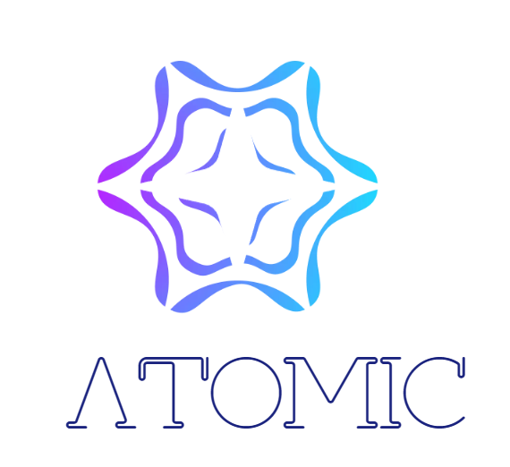

<p align="center">
  
  <br/>
  
  <br/>
</p>


# Petrochina TJ LM
石油工程垂域语言模型

## 项目介绍
 介绍文字。

## 训练数据

| Dataset         | Type                     | Language |  Number |
|-----------------|--------------------------|----------|---------|
| 石油工程文本    | Petro Engineering Text   | CN       | 8G      |
| 石油问答        | Petro QA                 | CN       | 150M    |
| 新闻            | News                     | CN       | 20G     |
| 维基中文        | Wiki_CN                  | CN       | 1.2G    |
| 知乎文本        | Zhihu                    | CN       | 1.7G    | 
| 万卷数据        | Wanjuan                  | CN       | 72G     | 
| 悟道开源        | Wudao                    | CN       | 27G     | 
| 书籍            | Books                    | CN&EN    | 110M    | 


## 训练过程

### 0.0.1 （Ari）
- 参数量1.5B
- layers 28
- hidden-size 2048
- attention-heads 32
- seq-length 1024

### 0.0.2 （Tau）
- 参数量3.3B
- layers 28
- hidden-size 3072
- attention-heads 32
- seq-length 1024
<p align="center">
  
  <br/>
</p>

### 0.0.3 （Gem）
- 参数量5.8B
- layers 28
- hidden-size 3456
- attention-heads 32
- seq-length 2048
<p align="center">
  
  <br/>
</p>


## 最近更新
-  (2023.4.3) 基于自有数据开始实验性训练语言模型，进行专业问答。
-  (2023.7.13) 加入开源数据集训练语言模型，以扩充其基础对话能力。
-  (2023.11.18) 优化数据配比提高模型容量，训练新一代模型。

## 即将到来的更新 
- [ ]  (2024.1.1) 对话中加入更多业务数据，根据应用场景，进行模型微调。


## 引用
```
@article{PetrochinaTJLM,
  title={Petrochina TJ LM: Petro Engineer domain LM},
  author={Bin Lai, Degang Wei, Xinqiang Feng, Yantong Liu, Ying Wang},
  year={2023}
}
```

